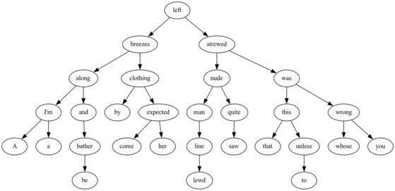

# stree

[](https://pkg.go.dev/github.com/creachadair/mds/stree)

This repository provides an implementation of Scapegoat Trees, as described in
https://people.csail.mit.edu/rivest/pubs/GR93.pdf

## Visualization

One of the unit tests supports writing its output to a Graphviz `.dot` file so
that you can see what the output looks like for different weighting conditions.
To use this, include the `-dot` flag when running the tests, e.g.,

```shell
# The -balance parameter is as specified for scapegoat.New.
go test -dot w300.dot -balance 300
```

Example output:

```
go test -dot x.dot -balance 50 -text limerick.txt
dot -Tpng -o limerick.png x.dot
```


